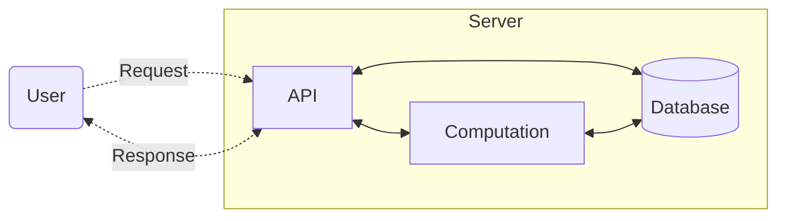

# Software Engineering

This repo is for a simple computation API for computing [Champernowne's Constant](https://projecteuler.net/problem=40), detailed below.

An irrational decimal fraction is created by concatenating the positive integers: $$0.12345678910{\color{red}\mathbf 1}112131415161718192021\cdots$$

It can be seen that the 12th digit of the fractional part is 1.

If $d_n$ represents the nth digit of the fractional part, find the value of the following expression. $$d_1 \times d_{10} \times d_{100} \times d_{1000} \times d_{10000} \times d_{100000} \times d_{1000000}$$

